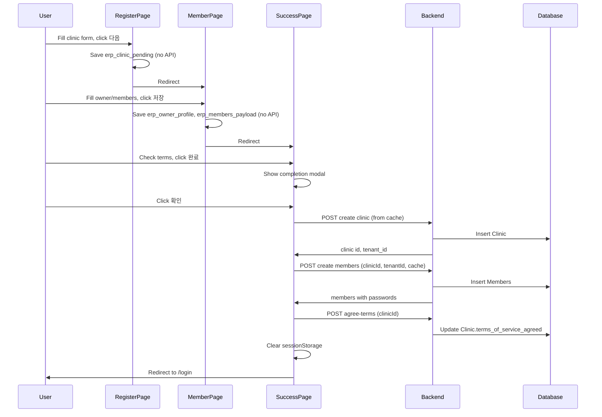

# Clinic register: deferred DB save + 이용약관 동의

## Current flow (problem)

- **[/clinic/register](apps/frontend/app/clinic/register/page.tsx):** "다음" → `POST/PUT /iam/members/clinics` → clinic saved to DB → sessionStorage updated → redirect to member.
- **[/clinic/register/member](apps/frontend/app/clinic/register/member/page.tsx):** "저장" → `POST /iam/members` → members saved to DB → sessionStorage updated → redirect to success.
- So DB is written in the middle of the flow; incomplete registrations and terms timing are problematic.

## Target flow

- **Register page:** "다음" → save clinic **form only** to sessionStorage (no API). Redirect to member.
- **Member page:** "저장" → save owner + members **form only** to sessionStorage (no API). Redirect to success.
- **Success page:** User sees summary, checks terms (required), clicks "완료" → completion modal → "확인" → **then** in one go: (1) create clinic in DB, (2) create members in DB, (3) set terms_of_service_agreed, (4) clear cache, (5) redirect to login.

---

## 1. Database

- **File:** [apps/backend/prisma/schema.prisma](apps/backend/prisma/schema.prisma)
- Add to `Clinic` model: `terms_of_service_agreed Boolean @default(false)`.
- Create and apply migration.

---

## 2. Register page – cache only on "다음"

- **File:** [apps/frontend/app/clinic/register/page.tsx](apps/frontend/app/clinic/register/page.tsx)
- In `handleSubmit` (around 530–624):
  - **Remove** the `fetch` call to `POST/PUT /iam/members/clinics`.
  - **Keep** building `payload` from `form` (same shape as current API body).
  - Save to sessionStorage under a single key used for "pending clinic", e.g. `erp_clinic_pending`:
    - `{ name, englishName, category, location, medicalSubjects, description, licenseType, licenseNumber, documentIssueNumber, documentImageUrls, openDate, doctorName }` (and any other fields the clinic create API expects).
  - Optionally keep `sessionStorage.removeItem("clinic_register_form")` and similar cleanup.
  - **Do not** set `erp_tenant_id` or `erp_clinic_summary` with `id`/`tenant_id` (no DB response yet).
  - Redirect: `window.location.href = "/clinic/register/member"`.
- Ensure validation and UI (e.g. "다음" disabled until required fields) stay as today; only the submit action changes from "API + redirect" to "cache + redirect".

---

## 3. Member page – use pending clinic and cache only on "저장"

- **File:** [apps/frontend/app/clinic/register/member/page.tsx](apps/frontend/app/clinic/register/member/page.tsx)
- **Data source when no DB clinic:**
  - In the same `useEffect` that currently fetches clinics (or a separate one), check for `erp_clinic_pending` in sessionStorage.
  - If `erp_clinic_pending` exists: parse it and set a single "virtual" clinic in state (e.g. `setClinics([pendingClinic])`, `setSelectedClinicId(pendingClinic.id)` if you use a synthetic id like `"pending"`, or treat it as the only option without calling GET clinics). Use this for display and for building the payload later. Do **not** call `GET /iam/members/clinics` in this path (no tenant_id yet).
  - If `erp_clinic_pending` does not exist but `erp_tenant_id` and/or `erp_clinic_summary` with id exist (e.g. returning from success or legacy flow), keep current behavior: fetch clinics from API and pre-select by `erp_editing_clinic_id` if present.
- **On "저장" (handleSubmit, around 314–366):**
  - **Remove** the `fetch` to `POST /iam/members`.
  - Build the same `payload` as today (clinicName, ownerPassword, ownerName, ownerEmail, ownerPhoneNumber, ownerIdCardNumber, ownerAddress, clinicEnglishName; **omit** clinicId and tenantId, or set placeholders).
  - Save to sessionStorage:
    - `erp_owner_profile`: current object (ownerName, ownerEmail, ownerPhoneNumber, ownerIdCardNumber, ownerAddress).
    - `erp_members_payload`: the payload you just built (so success page can send it after clinic is created), or a structure that includes owner + clinic name/english name so success can reconstruct CreateMembersDto. Include generated passwords if you generate them here (or generate on success page).
  - **Important:** Member creation API returns created members with passwords. Today those are stored in `erp_created_members` and shown on success. If we defer member creation, we have two options: (A) On success page, call create members and use the returned list (with passwords) for the same success UI. (B) Pre-generate passwords on member page, store in cache, and on success page send them to API (backend must accept pre-set passwords if needed). Prefer (A): success page calls create members and stores the response in state/sessionStorage for the same "show IDs and passwords" UI, then redirects after "확인".
  - Redirect: `window.location.href = "/clinic/register/success"`.
- Ensure "저장" still validates all fields and phone verification; only the submit action becomes "cache + redirect" instead of "API + redirect".

---

## 4. Success page – load from cache and finalize on "완료" → "확인"

- **File:** [apps/frontend/app/clinic/register/success/page.tsx](apps/frontend/app/clinic/register/success/page.tsx)

**4.1 Data loading**

- Keep loading from sessionStorage. Prefer:
  - Clinic summary for display: from `erp_clinic_summary` if present (member page can set it from `erp_clinic_pending` before redirect so success has a consistent shape), or from `erp_clinic_pending` (no id/tenant_id).
  - Owner: `erp_owner_profile`.
  - Members: either `erp_created_members` (current) or a "pending members" structure from `erp_members_payload`. If we only have `erp_members_payload`, the success page can show a summary like "Owner + 3 accounts to be created" and the actual member IDs/passwords will appear after the final API call (see below).

**4.2 Terms agreement (unchanged from previous plan)**

- At the **bottom of the "계정 정보" card**: add required checkbox + text "[필수] 재클릿 서비스 이용약관에 동의합니다" with "이용약관" as a link that opens the terms modal.
- Modal: full terms text (two articles), buttons "취소" (close) and "동의하고 계속하기" (set checkbox checked, close modal).
- "완료" button disabled until checkbox is checked.

**4.3 Finalize on "완료" → "확인"**

- When user clicks "완료", open the existing completion modal.
- When user clicks "확인" in that modal (before redirect):
  1. **Create clinic:** Build clinic payload from `erp_clinic_pending` (or from current `erp_clinic_summary` if it has all needed fields). Call `POST /iam/members/clinics` with auth (same token as rest of app). On success, get `clinic.id` and `clinic.tenant_id` from response.
  2. **Create members:** Build CreateMembersDto from `erp_owner_profile` and `erp_members_payload` (or equivalent), set `clinicId` and `tenantId` from step 1. Call `POST /iam/members` with auth. On success, get the returned members (IDs + passwords). Store in state or sessionStorage so the same success screen can show them if you want (or redirect immediately; current design redirects to login).
  3. **Agree terms:** Call new endpoint (e.g. `POST /iam/members/clinics/:id/agree-terms` or `POST .../register/agree-terms` with body `{ clinicId }`). Backend sets `Clinic.terms_of_service_agreed = true` (and optionally validates clinic created recently / not already agreed).
  4. **Clear cache:** Remove `erp_clinic_pending`, `erp_clinic_summary`, `erp_tenant_id`, `erp_owner_profile`, `erp_members_payload`, `erp_created_members`, `erp_editing_clinic_id`, and any other registration-related keys from sessionStorage.
  5. **Redirect:** `router.push("/login")`.
- If any step fails: show error (alert or inline), do not clear cache so user can retry or go back. Optionally still redirect to login after showing error (product decision).

**4.4 Display of members on success**

- Today success page shows member IDs and passwords from `erp_created_members` (set by member page after API). With deferred flow, that data is only available **after** the "확인" API calls. So either:
  - **Option A:** On "확인", run the three API calls; then update state with the created members and **keep the user on the success page** to show the same "생성된 계정 정보" (IDs + passwords) and add a second button "로그인 하기" that clears cache and redirects to login. Or:
  - **Option B:** On "확인", run the three API calls, clear cache, redirect to login immediately (user does not see IDs/passwords on screen; they could be sent by email if backend supports it). Option A is closer to current UX.

Recommendation: **Option A** – after "확인", call APIs, then show the created member list (from create members response), clear cache only when user clicks a final "로그인 하기" (or reuse "확인" to both show results and then redirect after a short delay). That way 이용약관 and deferred save work without losing the "show credentials" step.

---

## 5. Backend: agree-terms endpoint

- **File:** [apps/backend/src/modules/member/controllers/clinics.controller.ts](apps/backend/src/modules/member/controllers/clinics.controller.ts)
- Add a **public** (no JWT) endpoint, e.g. `POST /iam/members/clinics/register/agree-terms` with body `{ clinicId: string }`, or `POST /iam/members/clinics/:id/agree-terms`.
- **File:** [apps/backend/src/modules/member/services/clinics.service.ts](apps/backend/src/modules/member/services/clinics.service.ts)
- Implement `agreeTermsOfService(clinicId: string)`: find clinic by id; optionally require `clinic.created_at` within last 24–48 hours and `terms_of_service_agreed === false`; set `terms_of_service_agreed = true`; return.
- Use `@SetMetadata("skipJwtGuard", true)` or equivalent so the route is callable without auth (only for this one-time action).

---

## 6. Implementation order

1. **DB:** Add `terms_of_service_agreed` to Clinic; run migration.
2. **Backend:** Implement agree-terms endpoint and service.
3. **Register page:** Change "다음" to cache-only (erp_clinic_pending), no API.
4. **Member page:** When erp_clinic_pending exists, use it as single clinic (no GET clinics); change "저장" to cache-only (erp_owner_profile, erp_members_payload), no API; redirect to success.
5. **Success page:**

- Load from cache (support both erp_clinic_pending and erp_clinic_summary; erp_owner_profile; erp_members_payload / erp_created_members).
- Add terms block (checkbox + link + modal) and disable "완료" until agreed.
- On "확인": create clinic → create members → agree-terms → clear cache (and either show results then "로그인 하기" or redirect to login).

---

## 7. Diagram

---

## 8. Edge cases

- **Token on success page:** Create clinic and create members both need auth. Ensure the success page uses the same auth (e.g. `getAccessToken()`) as register/member; user must still have a valid session from the start of the flow.
- **Missing erp_clinic_pending on member page:** If user lands on member without going through register, redirect to register or show error.
- **Missing cache on success page:** If user lands on success without cache, current behavior (missingData → redirect to member) is fine; keep it.
- **Duplicate clinic:** If user goes back and clicks "다음" again, we overwrite erp_clinic_pending; no duplicate in DB until "완료" → "확인". If they already completed once, cache is cleared so they won’t see old data.
