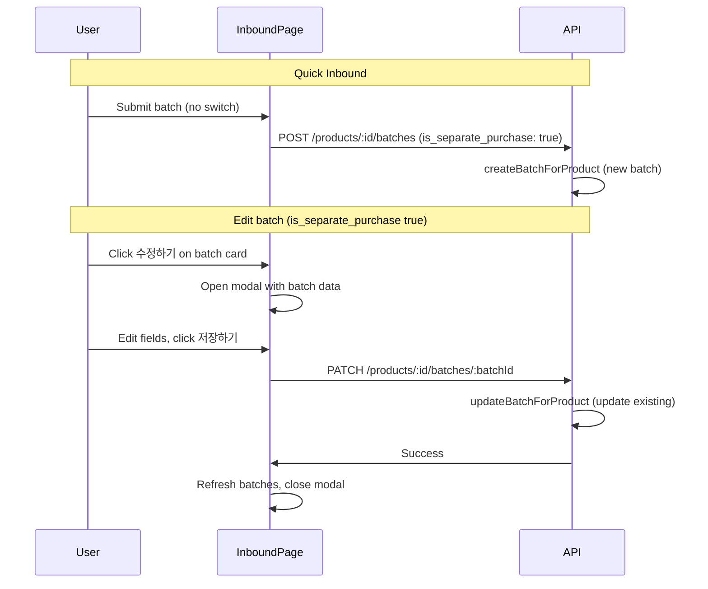

# Inbound: Quick Inbound Always Separate Purchase + Batch Edit Modal

## 1. Database: Batch table — new column

- **File:** [apps/backend/prisma/schema.prisma](apps/backend/prisma/schema.prisma)
- In `model Batch` (around line 144), add:
  - `reason_for_modification String?` (optional string for 수정 이유).
- Create and run migration: `npx prisma migrate dev --name add_batch_reason_for_modification`.

---

## 2. Backend: Batch update (no new batch, update existing)

- **New DTO:** `UpdateBatchDto` in [apps/backend/src/modules/product/dto/create-product.dto.ts](apps/backend/src/modules/product/dto/create-product.dto.ts) (or a new `update-batch.dto.ts`) with optional fields: `qty`, `expiry_date`, `manufacture_date`, `purchase_price`, `storage`, `inbound_manager`, `reason_for_modification` (all optional except at least one for a meaningful update). Use `@IsOptional()` and appropriate validators.
- **New endpoint:** In [apps/backend/src/modules/product/controllers/products.controller.ts](apps/backend/src/modules/product/controllers/products.controller.ts) add:
  - `PATCH :productId/batches/:batchId` (or `PUT`) with `@Body() dto: UpdateBatchDto`, `@Param('productId')`, `@Param('batchId')`, `@Tenant() tenantId`. Call a new service method.
- **New service method:** In [apps/backend/src/modules/product/services/products.service.ts](apps/backend/src/modules/product/services/products.service.ts) add `updateBatchForProduct(productId, batchId, dto, tenantId)`:
  - Find batch by `id === batchId`, `product_id === productId`, `tenant_id === tenantId`. If not found, throw `NotFoundException`.
  - Update that batch with `prisma.batch.update`: set only the fields present in DTO (qty, expiry_date, manufacture_date, purchase_price, storage, inbound_manager, reason_for_modification). Recalculate product `current_stock` from sum of batch `qty` and update product if needed (same pattern as in createBatchForProduct).
- **getProductBatches:** In the same service, extend the Batch `select` to include `manufacture_date`, `inbound_manager`, and after migration `reason_for_modification`. In the returned map, include these so the frontend can show and edit them.

---

## 3. Frontend: Quick Inbound card — remove switch, always separate purchase

- **File:** [apps/frontend/app/inbound/page.tsx](apps/frontend/app/inbound/page.tsx)
- Remove the "별도 구매" toggle block (the whole block with the switch and the two labels "별도 구매" / "빠른 입고") from the Quick Inbound card (around lines 2133–2164). Keep the card title as "빠른 입고" only.
- When building the create-batch payload for this form (around line 1835), always set `payload.is_separate_purchase = true` (remove dependency on `batchForm.isSeparatePurchase`).
- Set initial `batchForm.isSeparatePurchase` to `true` (around 1436) so any remaining references stay consistent; optionally remove `isSeparatePurchase` from form state later if unused.
- Remove or shorten the note that explains the difference between 별도 구매 and 빠른 입고 (around 2166–2175) so it only describes 빠른 입고 if needed.

---

## 4. Frontend: Batch cards — "수정하기" button and edit modal

- **Batch card (same file):** For each batch card where `batch.is_separate_purchase === true`, add a "수정하기" button in the **top-right** of the card. Use a flex container: left side = Batch number + badge, right side = "수정하기" (e.g. `ml-auto` or `justify-between`). Ensure the card has a stable key (e.g. `batch.id` if available); the list already gets `id` from API.
- **ProductBatch type:** Add `id: string` (and if missing, `manufacture_date`, `expiry_date`, `inbound_manager`, `reason_for_modification`) so the modal and API call can use `batch.id` and display/update these fields.
- **Edit modal state:** Add state for the batch edit modal: e.g. `editingBatch: { batch, product } | null`. When "수정하기" is clicked, set `editingBatch` to the selected batch and its product; when modal is closed or saved, set to `null`.
- **Modal UI (like the provided image):**
  - Title: "배치번호 {batch.batch_no}" with close (X) button.
  - Fields: 입고 수량 (with +/- and unit from product), 유효 기간 (date), 제조일 (date), 구매가 (with 전구매가 display if available), 보관 위치, 수정 이유 (new text field), 입고 직원.
  - Primary button: "저장하기". On submit: call `PATCH /products/{productId}/batches/{batchId}` with the form payload (qty, expiry_date, manufacture_date, purchase_price, storage, inbound_manager, reason_for_modification). On success: refresh batches for that product (same cache invalidation as after create), close modal, show success message.
- **No new batch:** The modal only updates the existing batch via PATCH; do not call the create-batch POST.

---

## 5. Flow summary

---

## 6. Files to touch (summary)

| Area     | File                     | Change                                                                                                   |
| -------- | ------------------------ | -------------------------------------------------------------------------------------------------------- |
| DB       | `prisma/schema.prisma`   | Add `reason_for_modification String?` to Batch                                                           |
| Backend  | New migration            | Add column                                                                                               |
| Backend  | DTO                      | Add `UpdateBatchDto`                                                                                     |
| Backend  | `products.controller.ts` | Add PATCH `:productId/batches/:batchId`                                                                  |
| Backend  | `products.service.ts`    | Add `updateBatchForProduct`; extend `getProductBatches` select/return                                    |
| Frontend | `inbound/page.tsx`       | Remove switch; always `is_separate_purchase: true` on quick inbound; add 수정하기 + modal and PATCH call |
